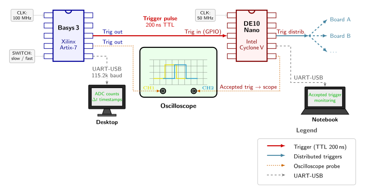

<p align="center">  </p>

# FPGA-based system for the emulation of a detector digitized dignal and trigger distribution

[](https://doi.org/10.5281/zenodo.19881390)
[](https://github.com/simop07/data_trigger_gen_FPGA/blob/main/LICENSE)

## Overview

In particle physics experiments, the TDAQ (trigger and data acquisition) system often needs to be developed and tested before a physical detector is available. This project builds an FPGA-based emulator that reproduces the digitized output of a particle detector and implements the trigger/busy logic with its distribution to downstream DAQ boards.

The physical scenario is the detection of **cosmic muons at sea level** (~10 Hz rate, ~600 cm² detector area). Muon pulses on a scintillator+PMT system are well characterised: fast linear rise, exponential decay, Landau-distributed amplitude. The emulator reproduces this signal statistically using pseudo-random number generation on an FPGA, without any physical sensor.

Two boards are used:
- **Basys 3** (Xilinx Artix-7, 100 MHz) - detector emulator: generates digitized pulses and a TTL trigger output
- **DE10-Nano** (Intel Cyclone V, 50 MHz) - trigger manager: validates triggers, handles busy logic, timestamps events, and distributes accepted triggers to DAQ boards

For a full description of the physics and the experimental setup, see [`PasquiniSimone_DataTriggerGeneration.pdf`](PasquiniSimone_DataTriggerGeneration.pdf).


---

## Repository structure

```
.
├── src/                        # VHDL source files for the Basys 3 firmware
├── constrs/                    # Xilinx constraints file for pin mapping
├── cpp/                        # C++ analysis code (ROOT-based)
├── plots/                      # Output plots from the analysis
├── scripts/                    # Utility scripts
└── PasquiniSimone_DataTriggerGeneration.pdf
```

---

## Source files

All firmware runs on the **Basys 3** board and is written in VHDL.

| File | Description |
|------|-------------|
| [`top.vhd`](./src/top.vhd) | Top-level entity: wires all components together and maps signals to physical I/O pins |
| [`random_source_lsfr.vhd`](./src/random_source_lsfr.vhd) | 24-bit Fibonacci LFSR - generates pseudo-random numbers every clock cycle (10 ns) using the Galois primitive polynomial x¹⁶+x¹⁴+x¹³+x¹¹+1; drives randomisation of pulse amplitude, baseline noise, and inter-event timing |
| [`muonGenerator.vhd`](./src/muonGenerator.vhd) | Core pulse generator - uses the LFSR output to produce digitized muon-like pulses with linear rise (8 samples) and exponential decay, mimicking a PMT signal after digitization; outputs ADC counts over UART |
| [`triggerLogic.vhd`](./src/triggerLogic.vhd) | Threshold comparator - fires a 200 ns TTL trigger pulse (3.3 V) when the ADC value exceeds a configurable threshold, compatible with DE10-Nano GPIO input |
| [`periodicTick.vhd`](./src/periodicTick.vhd) | Clock divider - generates the periodic tick used to control inter-pulse timing and the 100 Hz downsampled baseline readout |
| [`LongerPulse.vhd`](./src/LongerPulse.vhd) | Pulse stretcher - extends short FPGA logic pulses to meet minimum width requirements for external interfaces |
| [`debouncer.vhd`](./src/debouncer.vhd) | Switch debouncer - cleans the slow/fast mode selector switch input to avoid metastability |
| [`uart.vhd`](./src/uart.vhd) | UART transmitter - serializes ADC counts and timestamps at 115200 baud for readout by the desktop PC |

---

## Constraints

[`basys3Constraint.xdc`](./constrs/basys3Constraint.xdc) maps the VHDL port names to physical pins on the Basys 3 board (clock, UART TX, trigger output GPIOs, slide switches).

---

## Analysis code

ROOT-based C++ code for offline analysis of the data acquired over UART.

| File | Description |
|------|-------------|
| [`waveformAnalysisPos.cpp`](./cpp/waveformAnalysisPos.cpp) | Implementation for waveform-level analysis: pulse finding, baseline estimation, amplitude extraction |
| [`analysis.cpp`](./cpp/analysis.cpp) | Main analysis script: reads UART data, reconstructs the waveform, superimposes and sums pulses, fits the Landau distribution to the pulse sum |

The Landau fit on the summed pulses validates that the emulated pulse statistics match the physical expectation for energy loss of charged particles in a detector.

## Scripts

[`read.sh`](./scripts/read.sh) - shell script to read the UART stream from the Basys 3 and write ADC counts and timestamps to file.